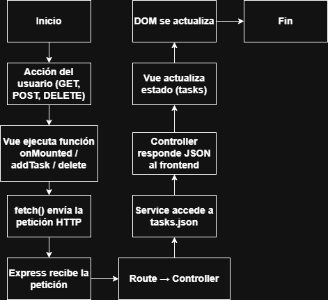
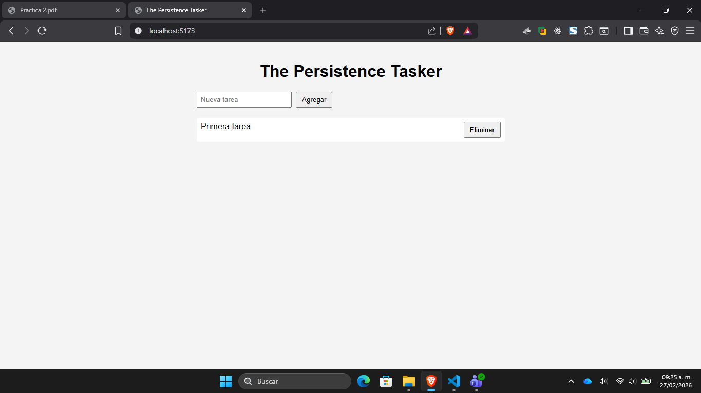
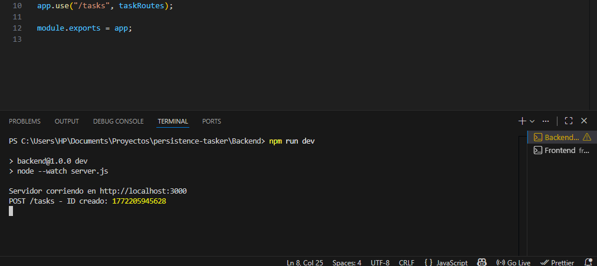
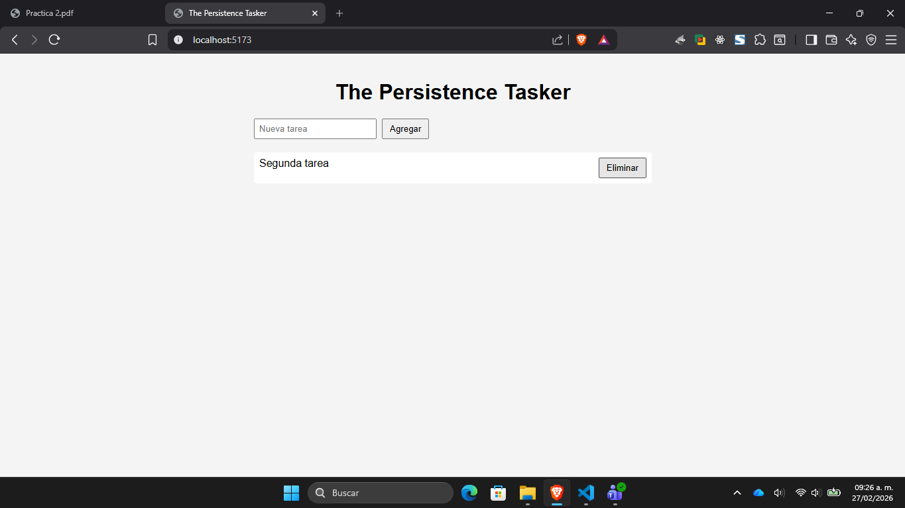
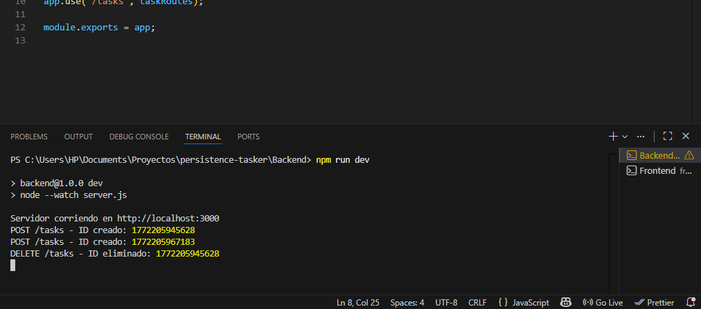

## Persistence Tasker

Este proyecto está conformado por tanto el backend y frontend. Así mismo, se explicará en este **README** las pruebas y diagrama de flujo que de igual manera, se encuentran en el proyecto.

---

### Backend

El backend cuenta con tres endpoints que son:

- **Enviar**
  `GET: http://localhost:3000/tasks`

 

- **Recibir**
  `POST: http://localhost:3000/tasks`
  `JSON: {
  "title": "Estudiar Express"
}`

 

- **Eliminar**
  `DELETE: http://localhost:3000/tasks`

---

### Frontend

Este solo tiene el trabajo de interfaz visual. Agregar un nombre para la tarea y se agrega, ya lo otro que podrás realizar es eliminarla. Se guarda de forma local mediante un JSON.

---

### Diagrama de flujo

## 

---

### Pruebas

En esta primera prueba se puede observar como en el Frontend se agrega la tarea llamada _Primera tarea_ como ejemplo.

## 

Ya se puede visualizar en la consola del backend como muestra el método utilizado que es el _POST_ para agregar la tarea y muestra su respectivo ID de tarea.

## 

Aquí se creo otra tarea llamada _Segunda tarea_ y se elimina la primera presionando el botón "Eliminar". Por ende, solo se visualiza ahora la tarea creada recientemente.

## 

En la consola se puede visualizar ahora como está el _POST_ previo, pero además de se encuentra el _POST_ para la segunda tarea creada y el _DELETE_ de la primera tarea.
Se puede comprobar esto al visualizar el ID de la tarea, corroborando que es el mismo.

## 
